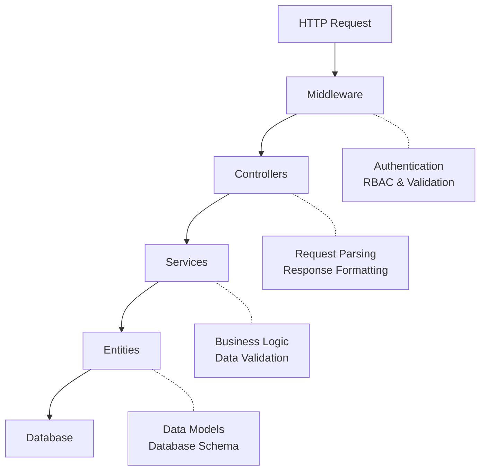

# System Architecture

This document explains how SudoSOS is built and why it's structured this way.

::: tip New to SudoSOS?
Start with **[SudoSOS 101](/general/0-welcome-to-sudosos)** to understand what SudoSOS is and the problems it solves before diving into the technical architecture.
:::

## How SudoSOS is Built

SudoSOS is a **REST API backend** built with Node.js and TypeScript. It follows a **layered architecture** that separates different concerns.

### The Layered Approach

The system is organized into distinct layers:

1. **Presentation Layer** (Controllers) - Handles HTTP requests and responses
2. **Business Logic Layer** (Services) - Contains the core logic
3. **Data Access Layer** (Entities) - Manages database interactions
4. **Cross-cutting Concerns** (Middleware, RBAC) - Handles authentication and validation

This separation makes the system easier to test, maintain, and extend.

### Technology Stack

- **Node.js 22+** - JavaScript runtime
- **TypeScript (strict mode)** - Type safety
- **Express.js** - Web framework for HTTP handling
- **TypeORM** - Database ORM with type safety and migrations
- **MariaDB/SQLite** - Database for data storage
- **JWT** - Token-based authentication
- **Stripe API** - Payment processing
- **Mocha + Chai** - Testing framework

### Why TypeScript?

TypeScript was chosen because it lowers the barrier of entry compared to more common "sophisticated" or battle-hardened programming languages. SudoSOS is built by and for GEWIS members, so to make sure that it is as easy to maintain as possible we wanted something that was quick to iterate and quick to learn. Moreover, the sudosos-frontend is also built in TypeScript, making it easier to switch between frontend and backend development.

## How Data Flows Through the System

Every request follows the same path through the system:

This flow ensures that every request is authenticated, validated, and processed through the business logic before touching the database.

## The Controller-Service-Entity Pattern

SudoSOS uses a variant of the MVC pattern. Each layer has a clear responsibility:

### Controllers

Controllers handle HTTP communication:

- Parse incoming requests and extract data
- Validate authentication and authorization
- Delegate business logic to services
- Format responses for the frontend
- Handle errors and return appropriate HTTP status codes

**Example**: The `TransactionController` receives HTTP requests, validates user permissions, then delegates transaction processing to the service layer.

### Services

Services contain the core business logic:

- Implement domain rules and validation
- Orchestrate operations across multiple entities
- Handle calculations and balance updates
- Manage database transactions
- Return structured responses to controllers

**Example**: The `TransactionService` validates that products exist, checks user balances, creates transaction entities, and updates balances.

### Entities

Entities represent the database structure using TypeORM:

- Define schema and relationships
- Provide type safety for database operations
- Include validation rules
- Support lifecycle hooks

**Example**: The `Transaction` entity defines the structure of a transaction and its relationships to users, sub-transactions, and points of sale.

<!-- TODO, maybe later. -->
<!-- ## Key Design Principles

### 1. Entities as Parameters
Services accept entity objects rather than IDs to improve type safety and reduce database queries.

### 2. Service Responsibility
Services contain business logic and validation, while controllers handle HTTP communication.

### 3. Type Safety
TypeScript strict mode enforces proper typing throughout the codebase.

### 4. Testing Strategy
Comprehensive testing at controller, service, and integration levels ensures reliability. -->
