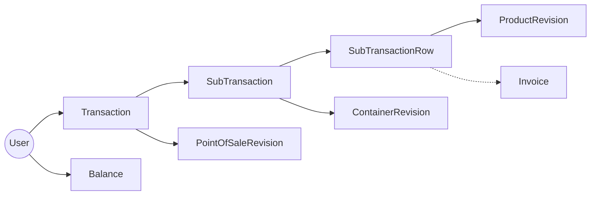
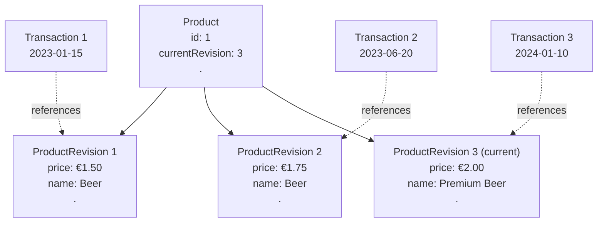
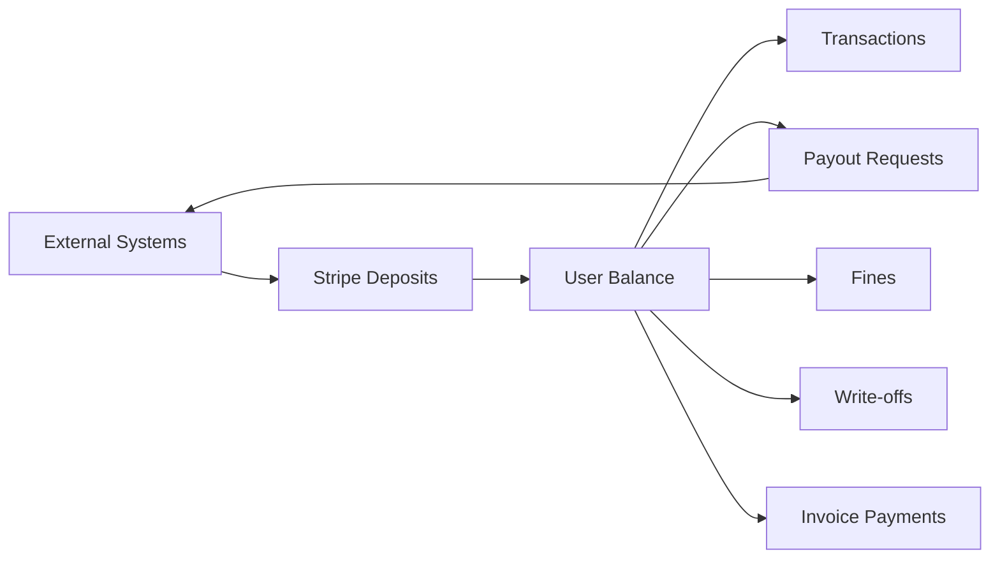

# Core Concepts

This document explains the fundamental business concepts and data model that power SudoSOS.

::: tip Prerequisites
Read **[System Architecture](/general/1-architecture)** first to understand the technical foundation before diving into business concepts.
:::

## SudoSOS as a Ledger

SudoSOS is a **financial ledger system**. Users do not have a `balance` field. Instead, a user's balance is calculated from their complete history of transfers and transactions. Every financial event is recorded and can be audited.

### Financial Perspective

- **Credits** (positive balances) - Result from deposits, payments, or refunds
- **Debits** (negative balances) - Result from purchases or withdrawals
- **Transactions** - Record purchases and payments
- **Transfers** - Move money in or out of the system

### Balance Calculation

A user's balance is not stored as a single value, but calculated by summing all their financial events:
- **Positive transfers** (deposits, write-offs, invoices) increase the balance
- **Negative transfers** (payouts, credit invoices) decrease the balance
- **Negative transactions** (purchases) decrease the balance

This approach prevents inconsistencies between the balance and the transaction history.

## Entity Relationship Model

How entities relate in SudoSOS:



### Key Relationships

- **User** is central - can be a member, organ, or invoice account
- **Transaction** links a buyer (User) to multiple sellers via SubTransactions
- **SubTransaction** represents purchases from one seller at one container
- **SubTransactionRow** represents individual products in a purchase
- **Invoice** can link multiple SubTransactionRows from different transactions

## Revision System

SudoSOS uses a revision system to track historical changes:

### Why Revisions?

When you change a product's price or a container's contents, past transactions should still reflect what was true at the time. Revisions solve this by maintaining historical snapshots.

### How It Works



When a transaction occurs, it references the current revision. Even if the product changes later, the transaction still points to the correct historical revision.

### Revisioned Entities

- **PointOfSale** → PointOfSaleRevision
- **Container** → ContainerRevision  
- **Product** → ProductRevision

## Transactions and Transfers

### Transactions

A transaction represents a purchase event with a hierarchical structure:

#### Transaction Hierarchy

1. **Transaction** - The top-level purchase
   - From which user (buyer)
   - Created by which user (can be different, e.g., borrelcrew)
   - At which point of sale
   - Total value

2. **SubTransaction** - Purchase from one seller/container
   - To which user/organ (the seller)
   - Which container
   - Subtotal

3. **SubTransactionRow** - Individual products
   - Which product (revision)
   - Quantity
   - Price per item
   - Total for this row
   - Optional invoice reference

#### Transaction Example

```
Transaction: John buys drinks at the bar
├── SubTransaction 1: Bar (GEWIS organ)
│   ├── SubTransactionRow 1: 2x Beer @ €2.00 = €4.00
│   └── SubTransactionRow 2: 1x Soda @ €1.50 = €1.50
└── SubTransaction 2: Snacks (Snack Committee)
    └── SubTransactionRow 3: 1x Chips @ €1.00 = €1.00

Total: €6.50
```

### Transfers

Transfers represent all financial movements in SudoSOS. They track money flowing between accounts, external systems, and special operations.

#### Transfer Types

Based on the `Transfer` entity, SudoSOS handles several types of transfers:

- **Payout Requests** - Users requesting their balance back to a bank account
- **Stripe Deposits** - External payments coming into SudoSOS via Stripe
- **Invoice Transfers** - Money movements related to invoice payments
- **Fine Transfers** - Financial penalties applied to users
- **Write-off Transfers** - Debt forgiveness or corrections
- **Waived Fine Transfers** - Fine penalties that are forgiven

#### Transfer Structure

Every transfer has:
- **From/To accounts** - Can be null for external operations (deposits/payouts)
- **Amount** - Including VAT calculations
- **VAT Group** - For tax reporting
- **Description** - Optional explanation for custom transfers
- **Related entity** - Links to the specific operation (invoice, fine, etc.)

#### Transfer Flow



## Invoices

Invoices group outstanding transactions for payment:

### Invoice Process

1. **Identify transactions** - Select uninvoiced transactions for a user
2. **Create transfer** - Calculate total and VAT breakdown
3. **Link rows** - Associate SubTransactionRows with invoice
4. **Generate PDF** - Create printable invoice
5. **Send notification** - Email user about invoice

### Invoice States

- **CREATED** - Invoice generated, not yet sent
- **SENT** - Invoice emailed to user
- **PAID** - Payment received and processed
- **DELETED** - Invoice cancelled (restores balance)

### Invoice Linking

When an invoice is deleted, the SubTransactionRows are unlinked, and the balance is restored. This prevents double-invoicing and maintains financial accuracy.

## Balances

Balances track how much credit each user has:

### Balance Types

- **Positive balance** - User has credit (can make purchases)
- **Negative balance** - User owes money (may be restricted from purchases)

### Balance Updates

Balance changes occur during:
- **Transactions** (decrease balance)
- **Deposits** (increase balance)
- **Invoice deletion** (restore balance)
- **Transfers** (move money between accounts)

### Balance Validation

The system can enforce rules like:
- Minimum balance requirements
- Maximum debt limits
- Purchase restrictions for negative balances

## Soft Deletion

SudoSOS uses soft deletion for most entities to preserve data integrity:

```typescript
@DeleteDateColumn()
public deletedAt?: Date;
```

### How Soft Deletion Works

When an entity is "deleted":
- `deletedAt` is set to the current timestamp
- Entity remains in database
- Queries exclude it by default (unless explicitly included)
- Can be restored by clearing `deletedAt`

### Benefits

- Preserves relationships and historical data
- Complete audit trail of all operations
- Can restore accidentally deleted data
- Prevents loss of transaction history

## Financial Safety

The system has several mechanisms for financial accuracy:

### 1. Validation
Checks on all financial operations:
- Product existence and pricing
- Container and POS validity
- User balance sufficiency
- Transaction data integrity

### 2. Database Transactions
All-or-nothing operations:
- If any part fails, everything rolls back
- Prevents partial updates
- Maintains data integrity

### 3. Balance Checks
Configurable rules:
- Minimum balance requirements
- Maximum debt limits
- Purchase restrictions

### 4. Audit Trails
Changes are tracked:
- Who made the change
- When it was made
- What was changed
- Why it was changed

### 5. Invoice Linking
Prevents double-invoicing:
- SubTransactionRows can only be linked to one invoice
- Deleting an invoice unlinks the rows
- Balance is restored when invoices are deleted

## Role-Based Access Control

SudoSOS uses a role-based access control (RBAC) system to manage permissions. It's a nice and extensible approach that controls what users can do.

### The Four-Layer Permission System

Permissions follow the pattern: `<action>:<relation>:<resource>:<attributes>`

1. **Actions** - What the user can do (`get`, `create`, `update`, `delete`)
2. **Relations** - Scope of access (`all`, `organ`, `own`)
3. **Resources** - What type of entity (`Transaction`, `Invoice`, `User`, `Product`, etc.)
4. **Attributes** - Which specific fields (`*`, `id`, `name`, `email`, etc.)

### Access Levels

The relation layer determines how broadly a user can access resources:

- **All** - Access to all resources of this type
- **Organ** - Access to resources owned by the user's organ/committee
- **Own** - Access only to the user's own resources

### Examples

- `get:all:Transaction:*` - View all transactions with all fields
- `get:organ:Product:name` - View product names owned by user's organ
- `update:own:User:email` - Update own email address
- `create:all:Invoice:*` - Create invoices for any user

### How Authorization Works

Every request goes through an authorization check:

```typescript
// In controller policy
policy: async (req) => this.roleManager.can(
  req.token.roles,           // User's roles
  'get',                     // Action
  await getRelation(req),    // Relation (all/organ/own)
  'Transaction',             // Resource
  ['*']                      // Attributes (usually all)
)
```

The system checks:
1. User's assigned roles and permissions
2. Whether the requested resource matches the relation level
3. Whether the user has the specific permission
4. Whether the requested attributes are allowed

## Next Steps

Now that you understand the core concepts, you can:

1. **[Transaction Flows](/general/3-transaction-flows)** - See how these concepts work in practice
2. **[External Integrations](/general/4-external-integrations)** - Learn how SudoSOS connects to external systems
3. **[Understanding the Codebase](/general/5-understanding-codebase)** - Start working with the code

Or go back to:
- **[System Architecture](/general/1-architecture)** - Review the technical foundation
- **[SudoSOS 101](/general/0-welcome-to-sudosos)** - Review the introduction
