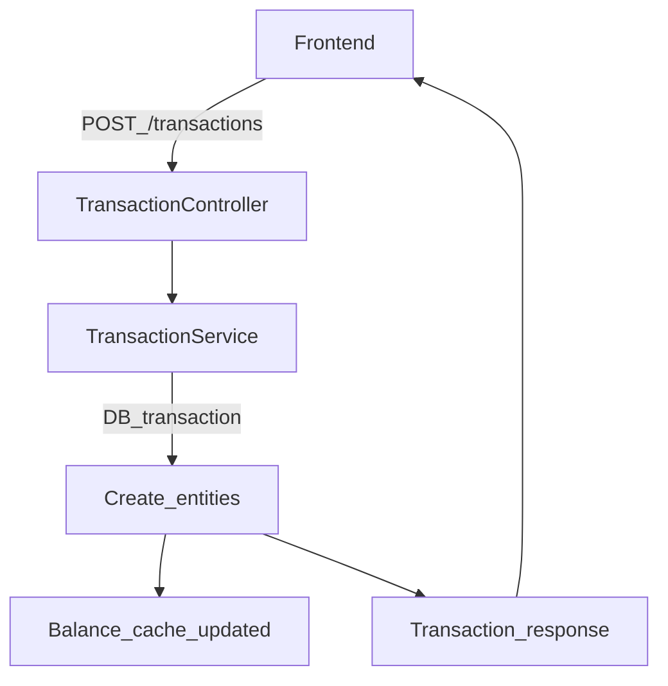

# Key Workflows

This chapter shows how SudoSOS behaves in practice. It does not try to document every endpoint; it explains the flows that keep the system correct.

**After reading this page, you should know** which entities and services are involved when money moves.

## Purchase (create a transaction)

**Trigger + actor**
- Member buys items (self-service) or a cashier enters the purchase (cashier mode).

**API surface**
- `POST /transactions` (create)
- `POST /transactions/validate` (validate without creating; used by some clients)
- `GET /transactions` and `GET /transactions/:id` (read)

**Entities touched**
- `Transaction`, `SubTransaction`, `SubTransactionRow`
- product/container/POS revisions referenced by rows and sub-transactions
- `Balance` cache (updated from transaction rows and transfers)

**Critical checks**
- product revisions exist and match the request
- container/POS configuration matches (what is available where)
- debt rules (`canGoIntoDebt` for the buyer)
- POS token restrictions for “lesser” POS tokens

**Who receives the money**
- Revenue is split by `SubTransaction`: the **container owner is the seller** for that part of the purchase.
  The POS owner and product creator are not used to decide who is paid.

**Side effects**
- receipts/notifications may be sent by subscribers after persistence

## Invoice

**Trigger + actor**
- Finance/admin groups eligible purchase rows into an invoice. Conceptually this is a **top-up** paid via bank transfer.

**API surface**
- `GET /invoices/eligible-transactions` (discover what can be invoiced)
- `POST /invoices` (create)
- `GET /invoices/:id` and `GET /invoices` (read)
- `GET /invoices/:id/pdf` (PDF)
- `PATCH /invoices/:id` (state changes, updates)
- `DELETE /invoices/:id` (delete/cancel invoice)

**Entities touched**
- `Invoice` (and invoice entries)
- `SubTransactionRow` links to invoices (to prevent double invoicing)
- an invoice transfer (void → user) that increases the user balance

**Critical checks**
- which rows are eligible (and for which user)
- linking/unlinking rows is consistent (no row belongs to multiple invoices)

**VAT note**
- VAT does not live on the invoice transfer. VAT is recorded via the underlying transactions and is reflected in seller-side settlement (seller payouts).

## Deposit (Stripe top-up)

**Trigger + actor**
- Member tops up their balance via Stripe.

**API surface**
- `POST /stripe/deposit` (create a Stripe payment intent; checks min/max top-up rules)
- `POST /stripe/webhook` (Stripe notifies the backend about payment intent updates)
- `GET /stripe/public` (frontend fetches Stripe public key and return URL)

**Entities touched**
- Stripe payment intent records (backend-owned representation)
- a top-up transfer (void → user) that credits the user when the payment succeeds
- balance cache (derived from transfers)

**Critical checks**
- webhook event authenticity (signature verification)
- event routing: only accept events intended for this service
- idempotency: the same Stripe event may be delivered multiple times

## Payout request (withdraw balance)

**Trigger + actor**
- Member requests a payout of part of their balance; admin approves and processes it.

**API surface**
- `POST /payoutrequests` (create request)
- `POST /payoutrequests/:id/status` (cancel, approve, process, etc.)
- `GET /payoutrequests` and `GET /payoutrequests/:id` (read)
- `GET /payoutrequests/:id/pdf` (PDF)

**Entities touched**
- `PayoutRequest` and `PayoutRequestStatus` records
- payout transfers (user → void) that move money out of the user account

**Critical checks**
- user has sufficient balance at request time and at approval time
- only admins can move a request to non-cancel states
- only the requesting user can cancel their own request

## Next pages

- **[System Architecture](/general/3-system-architecture)**
- **[External Integrations](/general/4-external-integrations)**
- **[Understanding the Codebase](/general/5-understanding-codebase)**
