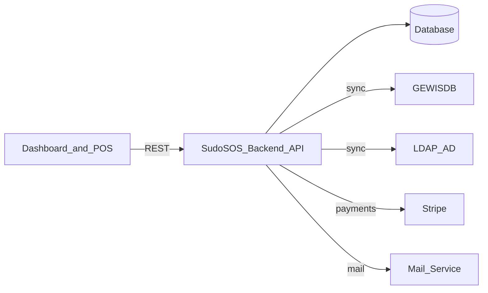

# System Architecture

This page gives you a mental map of the backend: what it talks to, what it owns, and where the rules are enforced.

**After reading this page, you should know** how the backend is structured, and where the rules from **[Core Concepts](/general/1-core-concepts)** are enforced.

## System context

- **Backend is authoritative** for money-changing operations (transactions, transfers, invoices, payouts).
- **Frontend is not trusted** for correctness; it only proposes actions.
- **External systems are sources of truth** for identity/structure and payments; the backend stores what it needs locally.

## Request lifecycle (where things happen)

Most endpoints follow the same shape:

1. **Middleware** authenticates the request and attaches a token.
2. **Controller** checks RBAC and translates HTTP to typed input/output.
3. **Service** validates domain rules and orchestrates multiple entities.
4. **Entities** persist data via TypeORM.

The practical rule: **controllers should stay thin**. If you need business rules, put them in a service.

## Where correctness is enforced

Money is not “best effort”. SudoSOS relies on a few hard guarantees:

- **Database transactions**: money-changing operations are executed atomically. If part of the operation fails, none of it is committed.
- **Historical truth via revisions**: products, containers, and points of sale are revisioned. Past purchases must keep referencing the revisions that were current at the time.
- **Balance cache**: balances are stored in the `balance` table and updated from transactions and transfers. Treat it as a cache; the event tables are the real history.
- **Soft deletion**: most entities are not hard-deleted, because financial history must remain auditable.

## Authorisation (RBAC)

RBAC checks live in controller policies. A request is authorised based on:
- action (`get`, `create`, `update`, `delete`)
- relation (`all`, `organ`, `own`)
- resource (e.g. `Transaction`, `Invoice`)
- attributes (which fields may be accessed)

The important part for contributors: **relation is computed per request** (often by loading a resource and comparing its ownership).

## What lives where (backend structure)

At a high level:

- `src/controller/`: routes, RBAC policy, request/response DTOs.
- `src/service/`: domain logic and orchestration.
- `src/entity/`: database models (including revisioned entities).
- `src/middleware/`: auth/token and request shaping.
- `src/rbac/`: roles, permissions, and enforcement helpers.
- `src/gewis/`: GEWIS-specific integrations (sync).

## What this page intentionally does not cover

- Endpoint-by-endpoint API reference. Use Swagger.
- Entity-by-entity code reference. Use TypeDoc.

::::: tip References
- Swagger: `https://sudosos.gewis.nl/api/api-docs/`
- TypeDoc: `/typedoc/`
:::::
