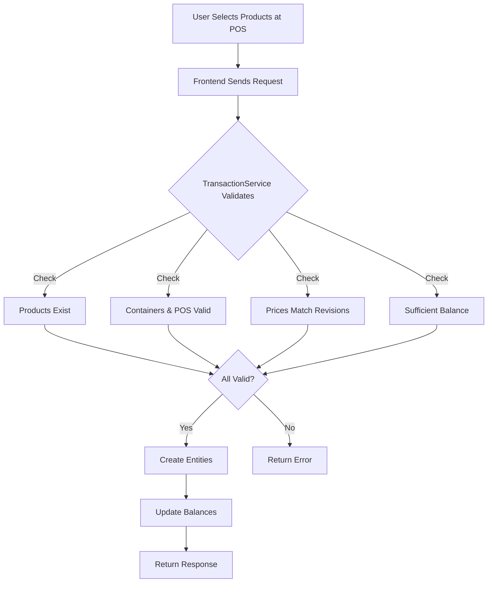
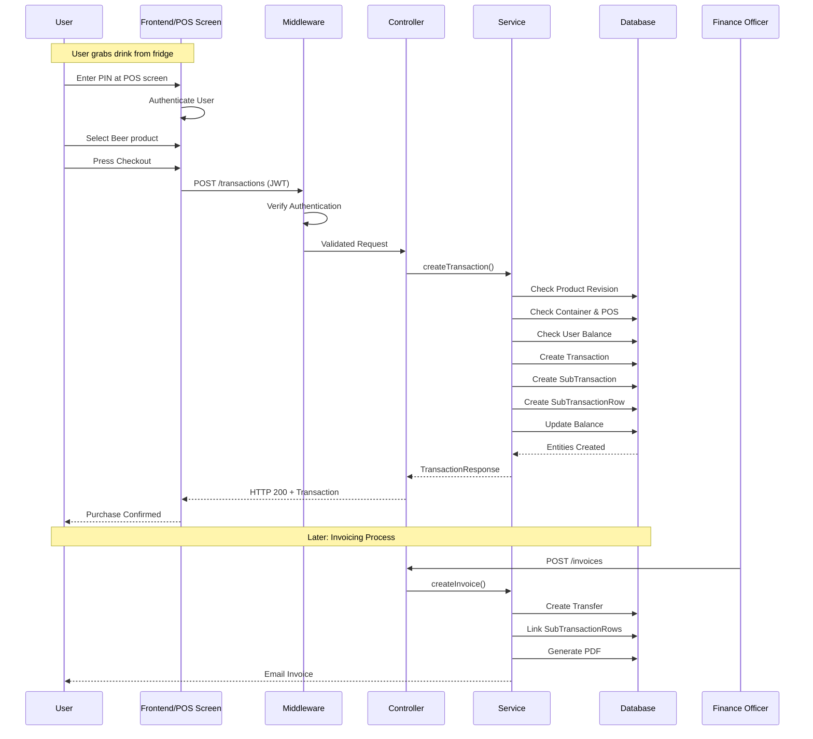
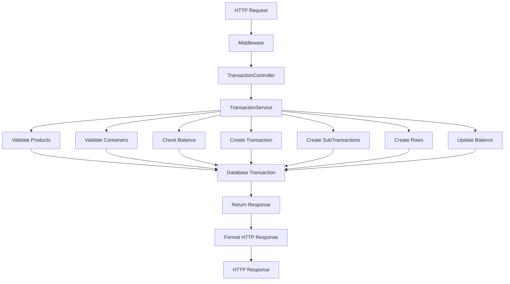

# Transaction Flows

This document shows how SudoSOS works in practice through real-world examples and transaction flows.

::: tip Prerequisites
Read **[Core Concepts](/general/2-core-concepts)** first to understand the business domain and data model.
:::

## Transaction Flow Overview

Here's how a transaction flows through the system:



## Example: Buying a Beer (Self-Service Mode)

::: tip POS Modes
SudoSOS supports two transaction modes:
- **Self-Service**: Users grab items, enter their PIN at a POS screen/tablet, select products, and checkout themselves
- **Borrelmodus (Managed Mode)**: An association member behind the bar enters transactions for users

Both modes use the same core transaction logic; the only difference is who operates the POS interface.
:::



## Data Flow Example

Here's how data flows through the system for a transaction:



## Transaction Validation Process

Before any transaction is created, the system performs comprehensive validation:

### 1. Product Validation
- Product exists and is active
- Product revision is current
- Price matches the revision
- Product is available in the specified container

### 2. Container Validation
- Container exists and is active
- Container belongs to the specified point of sale
- Container has the requested products

### 3. Point of Sale Validation
- POS exists and is active
- POS is accessible to the user
- POS has the required containers

### 4. Balance Validation
- User has sufficient balance (or debt limit allows)
- Transaction won't exceed configured limits
- User account is active and not restricted

### 5. Business Rules Validation
- Transaction follows association policies
- User has required permissions
- Transaction is within allowed time windows

## Error Handling

The system handles various error scenarios gracefully:

### Validation Errors
```typescript
// Product not found
if (!product) {
  throw new Error('Product not found');
}

// Insufficient balance
if (user.balance < transactionTotal) {
  throw new Error('Insufficient balance');
}
```

### Database Errors
```typescript
try {
  await this.manager.save(transaction);
} catch (error) {
  this.logger.error('Failed to save transaction:', error);
  throw new Error('Transaction failed');
}
```

### Rollback Scenarios
If any part of the transaction fails, the entire operation is rolled back:
- No partial transactions are created
- Balances remain unchanged
- Database consistency is maintained

## Invoice Flow

After transactions are created, the invoicing process can begin:

### 1. Invoice Creation
- Identify uninvoiced transactions for a user
- Calculate total amount and VAT
- Create transfer record
- Link SubTransactionRows to invoice

### 2. Invoice Processing
- Generate PDF document
- Send email notification
- Update invoice status
- Track payment status

### 3. Payment Processing
- Receive payment (Stripe, bank transfer, cash)
- Update invoice status to PAID
- Update user balance
- Send confirmation

### 4. Invoice Deletion
- Unlink SubTransactionRows
- Restore user balance
- Update invoice status to DELETED
- Log the deletion reason

## Balance Management

Balances are updated throughout the transaction lifecycle:

### Transaction Impact
- **Purchase**: Decrease balance by transaction amount
- **Refund**: Increase balance by refund amount
- **Deposit**: Increase balance by deposit amount

### Invoice Impact
- **Invoice Creation**: No immediate balance change
- **Invoice Payment**: Increase balance by payment amount
- **Invoice Deletion**: Restore balance to pre-invoice state

### Transfer Impact
- **Outgoing Transfer**: Decrease balance
- **Incoming Transfer**: Increase balance
- **Internal Transfer**: Net zero (debit one, credit another)

## Real-World Scenarios

### Scenario 1: Self-Service Purchase
1. User grabs beer from fridge
2. Walks to POS screen
3. Enters PIN to authenticate
4. Selects beer product
5. Confirms purchase
6. Balance decreases by €2.00
7. Transaction recorded with current product revision

### Scenario 2: Borrelmodus (Managed Mode)
1. User tells borrelcrew what they want
2. Borrelcrew enters transaction on behalf of user
3. User confirms the order
4. Same validation and creation process
5. Balance updated accordingly

### Scenario 3: Invoice Generation
1. User accumulates negative balance
2. Finance officer creates invoice
3. SubTransactionRows linked to invoice
4. PDF generated and emailed
5. User pays via Stripe
6. Balance restored to positive

### Scenario 4: Product Price Change
1. Product price increases from €2.00 to €2.50
2. New ProductRevision created
3. Old transactions still reference €2.00 revision
4. New transactions use €2.50 revision
5. Historical accuracy maintained

## Performance Considerations

### Database Transactions
- All related operations wrapped in single transaction
- Ensures atomicity and consistency
- Prevents race conditions

### Validation Caching
- Product and container data cached for performance
- Balance checks optimized for frequent access
- Revision lookups minimized

### Error Recovery
- Failed transactions are logged
- Partial states are prevented
- System remains consistent

## Next Steps

Now that you understand how transactions work in practice, you can:

1. **[External Integrations](/general/4-external-integrations)** - Learn how SudoSOS connects to external systems
2. **[Understanding the Codebase](/general/5-understanding-codebase)** - Start working with the code

Or go back to:
- **[Core Concepts](/general/2-core-concepts)** - Review the business domain
- **[System Architecture](/general/1-architecture)** - Review the technical foundation
- **[SudoSOS 101](/general/0-welcome-to-sudosos)** - Review the introduction
