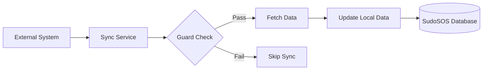

# External Integrations

This document explains how SudoSOS integrates with external systems to synchronise user data and organisational structure.

::: tip Prerequisites
Read **[Transaction Flows](/general/3-transaction-flows)** first to understand how the core system works before learning about external integrations.
:::

## Integration Architecture

SudoSOS is designed to integrate with external databases and systems to synchronise user data and organisational structure. This allows the system to leverage existing infrastructure while maintaining data consistency.

### Sync Service Pattern

The system uses **sync services** to periodically fetch and update data from external sources:



### Sync Service Features

- **Guard mechanism** - Determines which users should be synced
- **Dry run support** - Test sync operations without modifying data
- **Bidirectional flow** - Fetch new data and update existing records
- **Cleanup handling** - Remove stale data when external records are deleted

## GEWIS-Specific Integrations

SudoSOS integrates with two primary external systems at GEWIS:

### 1. GEWIS Database (GEWISDB) - Member Information

**Purpose**: Synchronise member details and membership status

**What it syncs**:
- Member details (name, email, membership status)
- Membership expiry dates
- Contact information updates
- New member registrations

**Implementation**: `GewisDBSyncService` (`src/gewis/service/gewisdb-sync-service.ts`)

**Sync Process**:
1. Connect to GEWISDB
2. Fetch current member list
3. Compare with local SudoSOS users
4. Update existing members
5. Create new member accounts
6. Deactivate expired memberships

### 2. GEWIS Active Directory (LDAP) - Organisational Structure

**Purpose**: Synchronise organ accounts and role assignments

**What it syncs**:
- Organ accounts (committees, boards)
- User roles based on AD groups
- Service accounts
- Organisational hierarchy

**Implementation**: `LdapSyncService` (`src/service/sync/user/ldap-sync-service.ts`)

**Sync Process**:
1. Connect to LDAP/Active Directory
2. Query organ groups and members
3. Update organ accounts in SudoSOS
4. Assign roles based on group membership
5. Remove users from groups they no longer belong to

## Generic Integration Pattern

The sync service pattern can be adapted for other external systems:

```typescript
// Abstract base class
export abstract class UserSyncService {
  // Which user types this service syncs
  abstract targets: UserType[];
  
  // Check if user should be synced
  async guard(user: User): Promise<boolean>;
  
  // Sync user data from external source
  async sync(user: User, isDryRun: boolean): Promise<boolean>;
  
  // Fetch new data from external source
  async fetch(): Promise<void>;
  
  // Cleanup when sync is removed
  async down(user: User, isDryRun: boolean): Promise<void>;
}
```

### Key Features

- **Guard mechanism** - Determines which users should be synced
- **Dry run support** - Test sync operations without modifying data
- **Bidirectional flow** - Fetch new data and update existing records
- **Cleanup handling** - Remove stale data when external records are deleted

## Integration Benefits

### Data Consistency
- Single source of truth for member information
- Automatic updates when external data changes
- Reduced manual data entry and errors

### Organisational Alignment
- Role assignments reflect current organisational structure
- Committee changes automatically update permissions
- Service accounts stay synchronised

### Reduced Maintenance
- No duplicate data entry
- Automatic member lifecycle management
- Centralised user management

## Sync Service Implementation

### Guard Mechanism

The guard mechanism determines which users should be synced:

```typescript
async guard(user: User): Promise<boolean> {
  // Check if user meets sync criteria
  return user.type === 'member' && 
         user.externalId && 
         !user.isDeleted;
}
```

### Sync Process

The sync process updates user data from external sources:

```typescript
async sync(user: User, isDryRun: boolean): Promise<boolean> {
  try {
    // Fetch external data
    const externalData = await this.fetchExternalData(user.externalId);
    
    if (isDryRun) {
      // Log what would be changed
      this.logger.info('Dry run: would update user', user.id);
      return true;
    }
    
    // Update local user data
    await this.updateUserData(user, externalData);
    return true;
  } catch (error) {
    this.logger.error('Sync failed for user', user.id, error);
    return false;
  }
}
```

### Cleanup Process

The cleanup process handles removed external records:

```typescript
async down(user: User, isDryRun: boolean): Promise<void> {
  if (isDryRun) {
    this.logger.info('Dry run: would deactivate user', user.id);
    return;
  }
  
  // Deactivate user account
  user.isActive = false;
  await this.manager.save(user);
}
```

## Integration Configuration

### Environment Variables

External integrations require configuration:

```bash
# GEWISDB Integration
GEWISDB_HOST=gewisdb.gewis.nl
GEWISDB_USERNAME=sudosos
GEWISDB_PASSWORD=secret

# LDAP Integration
LDAP_URL=ldap://ldap.gewis.nl
LDAP_BIND_DN=cn=sudosos,ou=services,dc=gewis,dc=nl
LDAP_BIND_PASSWORD=secret
LDAP_BASE_DN=ou=people,dc=gewis,dc=nl
```

### Sync Scheduling

Sync services can be scheduled to run periodically:

```typescript
// Daily member sync
@Cron('0 2 * * *') // 2 AM daily
async syncMembers() {
  await this.gewisDBSyncService.fetch();
}

// Hourly role sync
@Cron('0 * * * *') // Every hour
async syncRoles() {
  await this.ldapSyncService.fetch();
}
```

## Error Handling

### Connection Errors
- Retry logic for temporary failures
- Fallback to cached data when possible
- Alert administrators for persistent issues

### Data Validation
- Validate external data before applying
- Log discrepancies for review
- Prevent invalid data from entering system

### Rollback Scenarios
- Revert changes if sync fails
- Maintain data consistency
- Preserve audit trails

## Monitoring and Logging

### Sync Status
- Track sync success/failure rates
- Monitor data quality metrics
- Alert on sync failures

### Performance Metrics
- Sync duration and frequency
- Data volume processed
- System resource usage

### Audit Trails
- Log all sync operations
- Track data changes
- Maintain compliance records

## Future Integrations

The sync service pattern can be extended for additional integrations:

### Payment Systems
- Stripe webhook processing
- Bank transfer notifications
- Payment status updates

### Communication Systems
- Email service integration
- SMS notifications
- Push notification services

### Analytics Systems
- Transaction data export
- Usage statistics
- Performance metrics

## Best Practices

### Data Validation
- Always validate external data
- Implement data quality checks
- Handle malformed data gracefully

### Error Recovery
- Implement retry mechanisms
- Provide fallback options
- Maintain system stability

### Security
- Secure external connections
- Encrypt sensitive data
- Implement access controls

### Monitoring
- Track sync performance
- Monitor data quality
- Alert on issues

## Next Steps

Now that you understand external integrations, you can:

1. **[Understanding the Codebase](/general/5-understanding-codebase)** - Start working with the code

Or go back to:
- **[Transaction Flows](/general/3-transaction-flows)** - Review how the core system works
- **[Core Concepts](/general/2-core-concepts)** - Review the business domain
- **[System Architecture](/general/1-architecture)** - Review the technical foundation
- **[SudoSOS 101](/general/0-welcome-to-sudosos)** - Review the introduction
