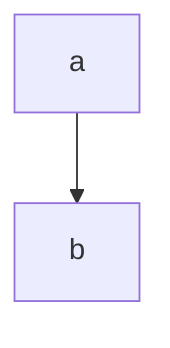

# Documentation Workflow

This document explains the process we use to generate the SudoSOS Backend documentation. Our workflow leverages several tools to produce clear, user-friendly documentation. The key tools we use include:

- [**TypeDoc**](https://typedoc.org/)
- [**typedoc-plugin-merge-modules**](https://github.com/krisztianb/typedoc-plugin-merge-modules)
- [**typedoc-plugin-markdown**](https://www.npmjs.com/package/typedoc-plugin-markdown)
- [**typedoc-vitepress-theme**](https://www.typedoc-plugin-markdown.org/plugins/vitepress)

These tools work together to create a seamless and navigable documentation site.

## Best Practices

When adding a new file to the codebase, ensure you include a `@module` JSDoc comment at the top. This comment defines the module that the file belongs to and helps keep the documentation organized.

If you're creating a new entity or module, add a `@mergeTarget` JSDoc comment at the top of the file. This tag defines the main text that will be displayed in the documentation. It's recommended to place the `@mergeTarget` comment within the entity definition file, as these files tend to be smaller and less frequently updated, making them easier to maintain.

::: danger
**Important**: If a file is created without a `@module` JSDoc comment, the TypeDoc generator may place it in an unintended location, which can cause confusion.
:::

Modules intended for internal use should be moved to the `internal/` namespace to distinguish them from public-facing documentation.

When submitting a pull request (PR), ensure you are gradually adding documentation. This incremental approach allows us to improve the documentation in manageable steps.

## TypeDoc with `typedoc-plugin-merge-modules`

**TypeDoc** generates documentation directly from TypeScript code, enabling us to maintain accurate and up-to-date docs. To improve navigability, we use the `typedoc-plugin-merge-modules`. This plugin consolidates multiple modules into a single, cohesive module, making the documentation easier to browse.

Our code structure differs from the layout we want in the documentation. The `typedoc-plugin-merge-modules` helps us reorganize and group related modules.

- The **first** `@module` tag in each file determines which module it belongs to in the documentation.
- The `@mergeTarget` tag designates which text will appear when a user navigates to a module in the documentation.

This setup ensures that the generated documentation is intuitive and reflects how the modules interact within the codebase.

---

### `typedoc-vitepress-theme` and `typedoc-plugin-markdown`

We use **typedoc-plugin-markdown** to convert the TypeDoc output into Markdown format. This format is then integrated into **VitePress**, the tool we use to generate our documentation site.

The VitePress configuration is straightforward. Most of the custom settings are defined in the `.vitepress/config.mts` file. By using this setup, we can efficiently generate and maintain a clean, navigable documentation site.

---

### Mermaid Diagrams

We use the [vitepress-plugin-mermaid](https://github.com/emersonbottero/vitepress-plugin-mermaid) plugin to render [mermaid.js](https://mermaid.js.org/) diagrams in our documentation. To use this plugin, simply add the following (example) code block to the tsdoc comment:

```ts
/**
 * ```mermaid
 * graph TD
 *     a --> b
 * ```
 */
```

This will render the following diagram:


---

By adhering to these guidelines and making use of the tools mentioned, we can maintain high-quality documentation that is easy to navigate and continuously updated as the codebase evolves.
